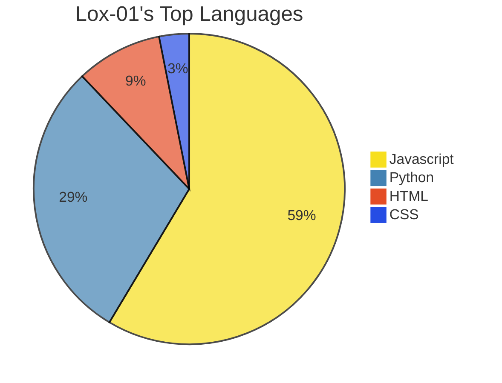

- 👋 Hi, I’m Lox.
- 👀 I’m interested in computer programming, gaming, learning and traveling.
- 🌱 I’m currently learning THREE.js, and various coding languages. Español, English, 漢語, 日本語, Русский.
- 💞️ I’m looking to collaborate on a web-based MMORPG I'm developing.
- 📫 How to reach me:
> 📧 theextremenoob77@gmail.com   
> 💿 lox0.1 (Discord)
- 😄 Pronouns: He / Him

