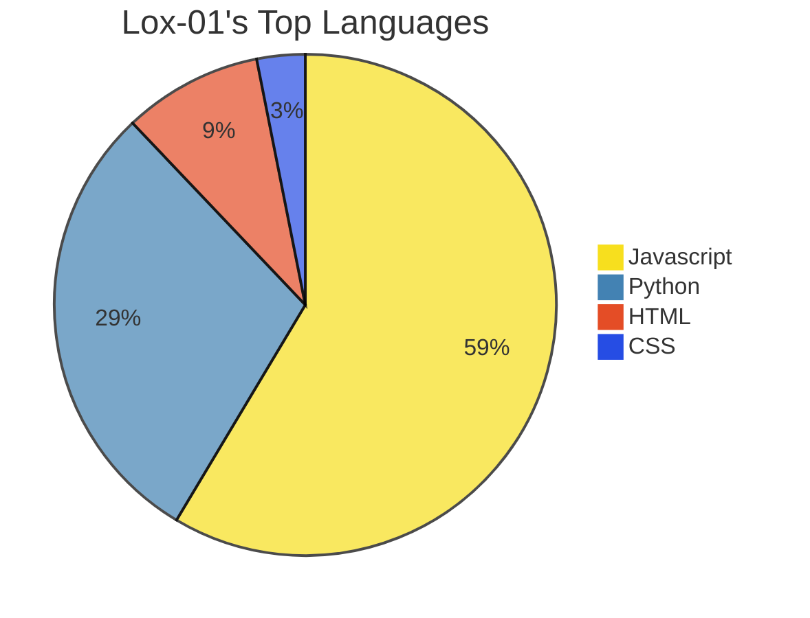

> 👋 Hi, I’m Lox.
> 👀 I’m interested in computer programming, gaming, learning and traveling.
> 🌱 I’m currently learning THREE.js, and various coding languages. Español, English, 漢語, 日本語, Русский.
> 💞️ I’m looking to collaborate on a web-based MMORPG I'm developing.
> 📫 How to reach me:
1. 💿 lox0.1 (Discord, preferred)
2. 📧 theextremenoob77@gmail.com

> To-do list for me:
- NextRealm   
- Poseidon   
- Pterodactyl Management Page   
- TreeSA   
- Internship Stuff   

